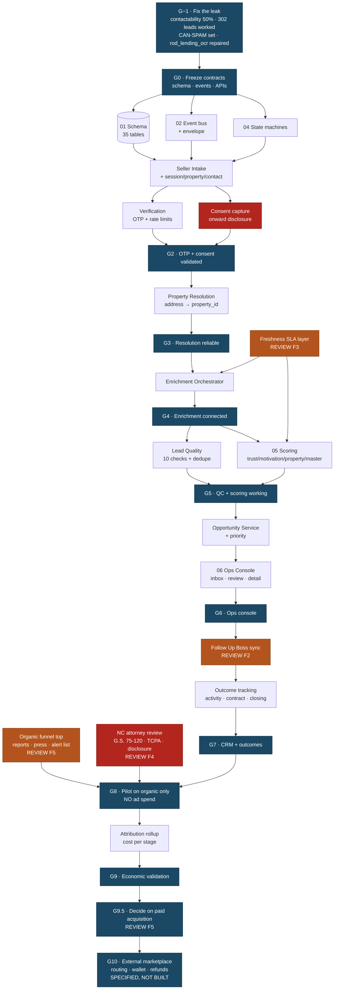

# Implementation Dependency Graph

What can be built in parallel, what genuinely blocks what, and where the gates
fall. Arrows mean "must exist before".

## The critical path

`G−1 → schema → intake → OTP/consent → resolution → enrichment → scoring →
opportunity → ops console → FUB → outcomes → pilot`.

Everything else is parallelisable. Three things are commonly assumed to be on
the critical path and are not:

- **The marketplace** (routing, wallet, refunds, buyer portal). Specified at G0
  so the contracts are stable, built at G10 or never. Roughly 40% of the
  blueprint's surface area sits behind a gate most businesses never reach.
- **ML scoring.** Deal Probability stays `NOT_ENOUGH_DATA` until labelled
  outcomes exist. The model registry is an empty table until G9.
- **Twenty CRM.** Replaced by Follow Up Boss for v1 per F2, removing a
  migration from the critical path entirely.

## What can start immediately, in parallel with G−1

- The schema and event catalog are already written and validated here.
- The organic funnel top — reports, press list, alert list — is the marketing
  strategy, needs no engineering from this spec, and is what makes G8 affordable.
- The NC attorney review. It has the longest external lead time of anything in
  the programme and gates G8. **Start it now, not at G7.**

## Longest pole

Not the code. The attorney review and the accumulation of enough labelled
outcomes to make §86's loop mean anything. Both are calendar time, not
engineering time, and both start earlier than the graph's arrows suggest.
